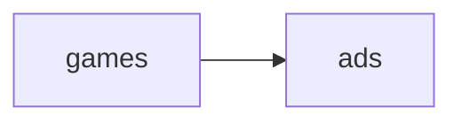

<h1 align="center">
NLW eSPORTS🚀
</h1>
<p align="center">
<a target="_blank" rel="noopener noreferrer" href="https://camo.githubusercontent.com/66fe19848b26f90cf13a99b798f742a9e7809b27/68747470733a2f2f696d672e736869656c64732e696f2f62616467652f746563682d66726f6e742d2d656e642d627269676874677265656e"></a>
  

Nessa NLW construímos o nosso projeto: o Find your DUO, fazendo o setup do ambiente de desenvolvimento com Node, React e React Native.

Instrutores: Diego Schell Fernandes e Rodrigo Gonçalves

### NLW SERVER

- Instalar o node.
- Rodar o `npm init -y` para criar o arquivo package.json.
- Instalar o express.
- Criar um arquivo `server.js` dentro da pasta `src`
- Configurar endpoint no arquivo `server.js`.
- Rodar o comando `node src/server.js`.
- Testar em algum client REST.

Clientes REST para testes citados:

- Postman
- Insomnia
- Hoppscotch

O Hoppscotch é um PWA ou (Progressive Web App), ou seja, é a página web ou sites regulares que aparecem como aplicativos aos usuários; combinando os recursos oferecidos pelos navegadores modernos com os benefícios da experiência móvel.

- Modificar o arquivo `server.js` para `server.ts`
- Instalar de Typescript como dependência de Desenvolvedor com o comando `npm i typescript -D`
- Rodar o comando `npx tsc --init` para criar um arquivo de configuração typescript.
- Configurar o package.json para ler o conteúdo em typescript e gerar o arquivo com extensão js:

```json
{
  "scripts": {
    "build": "tsc"
  }
}
```

- Configurar o arquivo `tsconfig.json` para especificar o diretório raiz da aplicação, em qual diretórios serão convertidos para a extensão js. e especifico como o TypeScript pesquisa um arquivo de um determinado módulo.

- Instalar o `npm i @types/express -D` pois o express não dá suporte ao typescript.
- Instalar o `npm i ts-node-dev -D`, essa ferramenta compila o projeto com Typescript e reinicia o projeto quando o arquivo é modificado.

### NLW WEB

Usamos o Vite que é uma ferramenta de construção para front-end, ele provê uma ferramenta de criação rápida comparada ao create-react-app (CRA).

Configurações feitas:

- Rodar o comando `npm create vite@latest`.
- Digitar `y` para prosseguir com a instalação.
- Inserir o nome do projeto `web`
- Selecionar a biblioteca `react`.
- Selecionar a variante `typescript`.
- Ir para o diretório do projeto `cd web`
- Instalar as dependências com `npm install`
- Rodar o `npm run dev`

Obs: Troquei a porta que roda o projeto web, configurado no arquivo `vite.config.ts`.

```typescript
export default defineConfig({
  // ...
  server: {
    port: 3000,
  },
});
```

### NLW MOBILE

- Abordagem nativa:

  ```mermaid
  graph LR;
      Android-->Java/Kotlin;
      Java/Kotlin-->.apk;
  ```

  ```mermaid
  graph LR;
      IOS-->Object-c/Swift;
      Object-c/Swift-->.ipa;
  ```

- Abordagem cross platform.

  ```mermaid
  graph LR;
      JavaScript-->Bundle;
      Bundle-->Expo;
      Expo-->Android;
      Expo-->IOS;
  ```

- Usamos Javascript.
- Empacotamos a aplicação em um bundle.
- Carregamos para dispositivos android e IOS.
- Utilizamos a ferramenta Expo.

EXPO é uma plataforma de código aberto para criar aplicativos nativos universais para Android, IOS e Web com Javascript e React.

- Ter o git e o node.js instalado
- Instalar o Expo CLI com o comando `npm i --global expo-cli`
- Verificar se a instalação ocorreu com sucesso, usando o comando `expo --version`.
- Executar o comando `expo init mobile` para criar o projeto.
- Escolher o template blank (Typescript).

## Aula 2

Desenvolvemos parte do nosso projeto, fazendo a interface web e mobile da aplicação.

### Interface Web

- Usamos o [modelo](https://www.figma.com/community/file/1150897317533332617) do [figma](https://www.figma.com/).

- Instalamos o tailwind usando o postcss, seguindo a [documentação do tailwind](https://tailwindcss.com/docs/installation/using-postcss).

- Modificamos o arquivo de configuração do tailwind de acordo com os diretórios desejados.

- Criamos o arquivo de configuração do tailwind e do postcss com o comando `npx tailwindcss init -p`

- Instalamos o phosphor-react para adicionar ícones, usando o comando `npm i phosphor-react`.

- Fizemos a interface do projeto de acordo com o modelo disponibilizado.

- Colocamos a fonte Inter.

### Interface Mobile

- Exportamos os [assets](https://drive.google.com/drive/folders/13kZ1SCasn1ZAKkmznieR0IwodH95XLG9) com as imagens de logo, splash, jogos, configurações de cores e um arquivo com uma lista de jogos.

- Instalamos a extensão RComponent para o VS Code que facilita na criação de blocos de código.

- Adicionamos a fonte Inter com o comando `expo install expo-font @expo-google-fonts/inter`.

- Instalamos a biblioteca react-native-safe-area-context para que os componentes sejam exibidos na área segura da tela, usando o comando `expo install react-native-safe-area-context`.

- Instalação da biblioteca LinearGradient para ter os detalhes de gradiente com o comando `expo install expo-linear-gradient`

- Para importarmos as imagens, usamos a declaração de módulo dos arquivos no formato png.

- Criamos:

  - Componente Background;
  - Tela Home;
  - Componente Loading (caso as fontes ainda não estejam carregadas);
  - Componente Heading (título e subtítulo);
  - Componente de Cards dos games;

- Usamos o componente FlatList para carregar a lista de jogos da pasta utils e passar as informações para os cards.

- Para ver a aplicação no celular, é preciso baixar o Expo Go e escanear o código QR disponibilizado ao executar o comando `npm start` no projeto.

## Aula 3

Criamos o back-end da aplicação.

### Entidades



- Games:

  - id
  - title
  - bannerUrl

- Ads:

  - id
  - gameId
  - name
  - yearsPlaying
  - discord
  - weekDays
  - hourStart
  - hourEnd
  - useVoiceChannel
  - createAt

- Caso de uso:
  - Listagem de games com contagem de anúncios;
  - Criação do novo anúncio;
  - Listagem de anúncios por games;
  - Busca do discord pelo ID do anúncio.

### Tipos de parâmetros

- Query usado para persistir estado, filtro, ordenação, paginação. Os parâmetros são nomeados.

- Route usado para acessar determinada página com algum identificador de recurso, os parâmetros não são nomeados.

- Body usado para envio de informações sensíveis, ou envio de formulários com dados pessoais e senhas.

### Banco de Dados

Caso não esteja muito familiarizado com banco de dados, utilize um banco de dado relacional.
Usaremos o SQLite por ser prático e acessível.

Bancos não relacionais são mais suscetíveis à desorganização ou várias modificações, quando não são bem estruturados.

#### Comunicação com banco de dados

- node-sqlite3: driver nativo (uma camada de baixo nível que faz a conexão com o banco de dados) entre node e SQLite.
  Este tipo de comunicação requer conhecimento maior em relação à sintaxe SQL.

- Query builder:

  Significa construtor de consulta, permite que você construa instruções sql em um programático e independente de banco de dados. No caso, usamos o Knex.js.

  - Knexjs: é um query builder para NodeJs capaz de conectar com Postgres, SqlServer, Mysql, MariaDb, Oracle, Amazon e SQLite3.

- ORM:
  Significa Object-Relational Mapping ou mapeamento objeto-relacional em português.
  É uma técnica que ajuda você a consultar e manipular dados de bancos de dados usando um paradigma orientado a objetos.
  Ex: TypeORM, Sequelize e Prisma.

  - Prisma: é uma ferramenta open source, um ORM com 3 camadas principais em sua arquitetura.
    - Prisma Client: um construtor de queries gerado automaticamente e type-safe para Node.js e TypeScript;
    - Prisma Migrate: sistema de migração;
    - Prisma Studio: o produto principal da tecnologia. Trata-se de uma interface do usuário feita para visualizar e editar os dados na database;

#### Configurações do Prisma

- Instalamos o prisma com o comando `npm install prisma --save-dev` ou `npm install prisma -D`.

- E inicializamos ele com o comando `npx prisma init --datasource-provider sqlite` que gera um diretório com um arquivo de esquema Prisma e um arquivo de ambiente.

- Configuramos o diretório que o prisma irá gerar um arquivo de banco de dados no documento .env.

- Criamos um modelo que representa a tabela Games.

- Rodamos o comando `npx prisma migrate dev`

- Informamos o nome para gerar uma migration: `create table games`, essa migrations contém uma versão de controle da tabela gerada.

- O comando `npx prisma studio`, irá gerar uma interface gráfica para navegar no banco de dados, fazer filtros, paginação e criar novos registros das tabelas.

- Criamos um modelo Ads.

- Rodamos o comando `npx prisma migrate dev`

- Informamos o nome para a migration `create table ads`.

- Extensão SQLite:
  No Visual Studio Code (VS Code), podemos usá-la para explorar informações do banco de dados SQLite.

  Após a instalação da extensão podemos, em cima do arquivo `db.sqlite`, clicar com o botão direito do mouse e selecionar a primeira opção `Open Database`.

  Isso exibirá uma opção no explorador do VS Code denominado SQLITE EXPLORER, onde podemos ver as informações da tabela que criamos.

- Populamos a tabela de jogos no prisma studio.

- Rodamos o comando `npm install @prisma/client`.

- O comando `npx prisma generate` é responsável por gerar uma pasta client no node_modules, com informações relacionados às tabelas criadas.

### Outras configurações:

Adicionamos a flag `--exit-child` no arquivo package.json, na parte de scripts, onde rodamos a aplicação em modo de desenvolvimento. Isso serve para fechar uma conexão antiga e abrir uma nova quando modifico algum arquivo no projeto, fazendo o node reinicializar normalmente.

Para a aplicação aceitar requisições do front-end, precisamos configurar o cors e como usamos o typescript, precisamos instalar o `npm i @types/cors`.

